# **实验二** HBase的安装与使用

**组号：24**

**张扬2020212185**

**付驰2020212135**

**陈昊华2020212194**

**思维导图：**

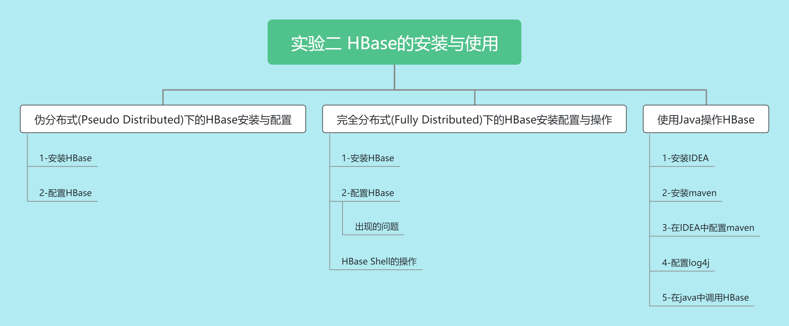

**大纲（可点击快速跳转）：**

[TOC]

## 伪分布式(Pseudo Distributed)下的HBase安装与配置

实验环境如下：

`Ubuntu` 22.04 虚拟机
`JDK` 1.8
`Hadoop` 2.10.1
`HBase` 2.4.5

### 1-安装HBase

同Fully Distributed Mode。

与hadoop2.10.1对应的HBase版本之一是2.4.5 。从https://archive.apache.org/dist/hbase/2.4.5/hbase-2.4.5-bin.tar.gz下载对应的版本

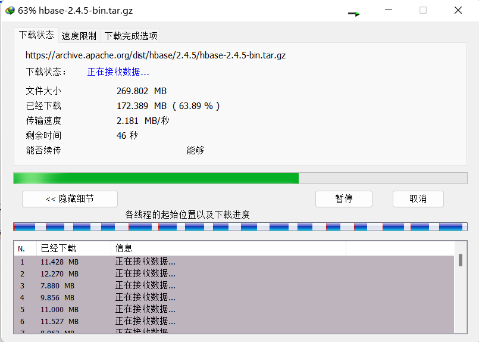

下载相关文件，并将其放在想安装的位置。为了方便，选择与上一份实验手册相同的安装位置： `/opt/hbase` 。

```shell
tar xzf hbase-2.4.5-bin.tar.gz
sudo mv ./hbase-2.4.5 /opt/hbase
```

**张扬2020212185的截图：**

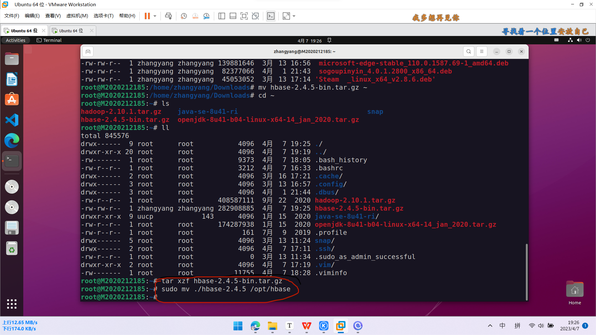

### 2-配置HBase

为了方便操作，为HBase配置环境变量：

```shell
vim /etc/profile
```

在profile末尾添加以下两行配置：

```shell
export HBASE_HOME=/opt/hbase
export PATH=$PATH:$HBASE_HOME/bin
```

**张扬2020212185的截图：**

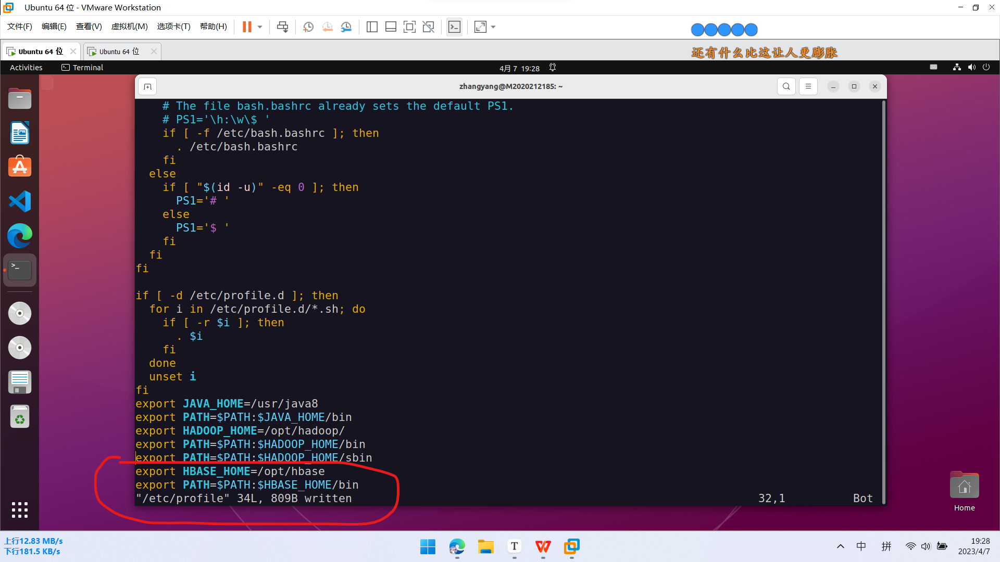

更新环境变量：

```shell
source /etc/profile
```

**张扬2020212185的截图：**

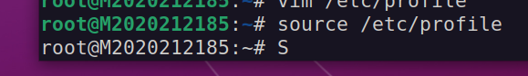

修改配置文件 `/opt/hbase/conf/hbase-site.xml` ：

```xml
<property>
    <name>hbase.rootdir</name>
    <value>hdfs://localhost:9000/hbase</value>
</property>
<property>
    <name>hbase.cluster.distributed</name>
    <value>true</value>
</property>
<property>
    <name>hbase.zookeeper.quorum</name>
    <value>localhost</value>
</property>
<property>
    <name>dfs.replication</name>
    <value>1</value>
</property>
<property>
    <name>hbase.zookeeper.property.clientPort</name>
    <value>2181</value>
</property>
<property>
    <name>hbase.zookeeper.property.dataDir</name>
    <value>/opt/hbase/zookeeper</value>
</property>
```

**张扬2020212185的截图：**

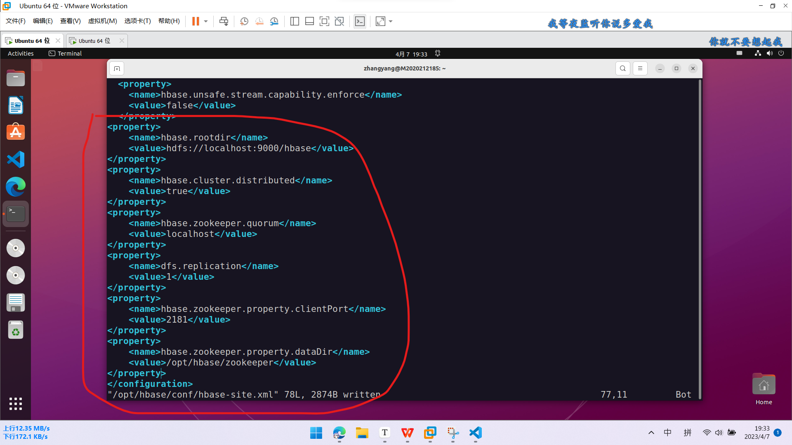

注意， `hbase.rootdir` 属性的值应为 `hdfs://localhost:9000/hbase` ； `dfs.replication` 可以设置为1( 非必须)；因为是伪分布式，所以 `hbase.cluster.distributed` 可以为 `true` 。

编辑`hbase-env.sh`文件，添加以下配置，来配置区域服务器的路径，并启动自动管理zookeeper：

**张扬2020212185的截图：**

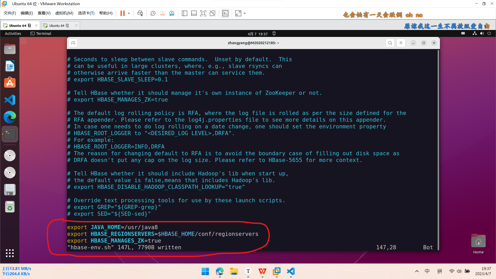

启动hbase进行测试

```shell
start-all.sh
start-hbase.sh
hbase shell
```

**张扬2020212185的截图：**

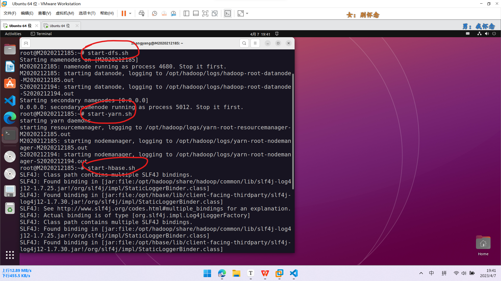

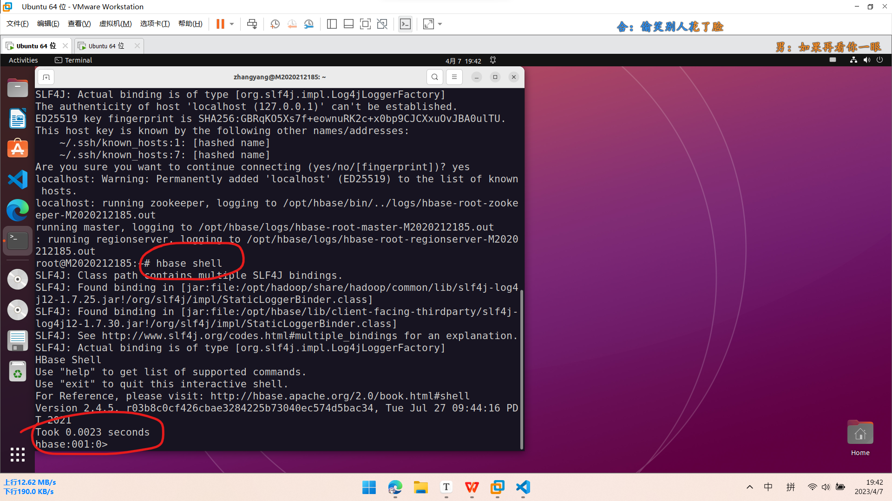

运行 `jps` 指令，如果出现 `HQuorumPeer` ， `HRegionServer` 和 `HMaster` ，则证明启动成功：

**张扬2020212185的截图：**


## 完全分布式(Fully Distributed)下的HBase安装配置与操作

### 1-安装HBase

同伪分布，多两台slave

### 2-配置HBase

编辑`/etc/profile`同伪分布。

HBase默认写到 `/${java.io.tmpdir}/HBase-${user.name}` 。` $ {.io.tmpdir} `通常映射到 /tmp 目录下。可以修改配置文件`/opt/hbase/conf/hbase-site.xml` 以规定其映射目录；同时需要修改配置文件来指定内置zookeeper的运行文件保存位置：

**张扬2020212185的截图：**

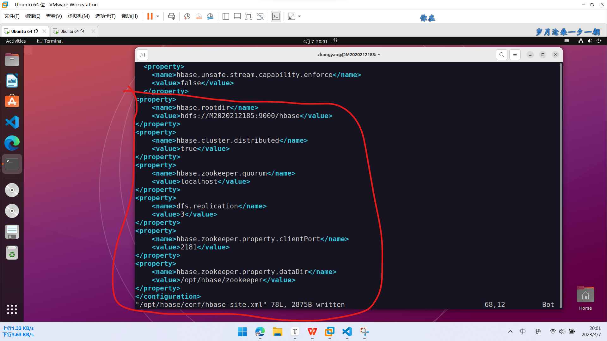

```xml
<property>
    <name>hbase.rootdir</name>
    <value>hdfs://M2020212185:9000/hbase</value>
</property>
<property>
    <name>hbase.cluster.distributed</name>
    <value>true</value>
</property>
<property>
    <name>hbase.zookeeper.quorum</name>
    <value>localhost</value>
</property>
<property>
    <name>dfs.replication</name>
    <value>3</value>
</property>
<property>
    <name>hbase.zookeeper.property.clientPort</name>
    <value>2181</value>
</property>
<property>
    <name>hbase.zookeeper.property.dataDir</name>
    <value>/opt/hbase/zookeeper</value>
</property>
</configuration>
```

`hbase.rootdir` 属性的配置应在之前配置的HDFS的 `fs.defaultFS` 属性上添加hbase目录；在`dfs.replication` 属性中设置副本数量。默认情况下，将副本设置为 1。在完全分布式模式下，存在多个数据节点，因此我们可以通过设置 `dfs.replication` 为超过1的值。

编辑`hbase-env.sh`文件，添加以下配置，来配置区域服务器的路径，并启动自动管理zookeeper：

同伪分布。

启动hbase进行测试，指令如下：

```shell
start-all.sh
start-hbase.sh
hbase shell
```

**张扬2020212185的截图：**

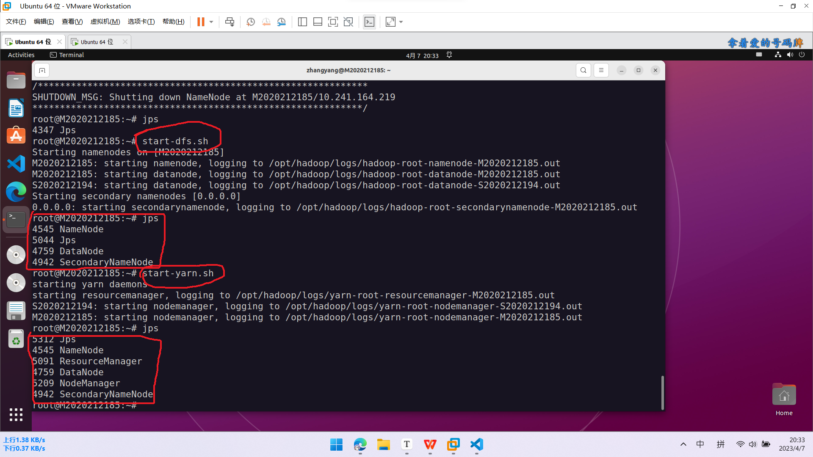

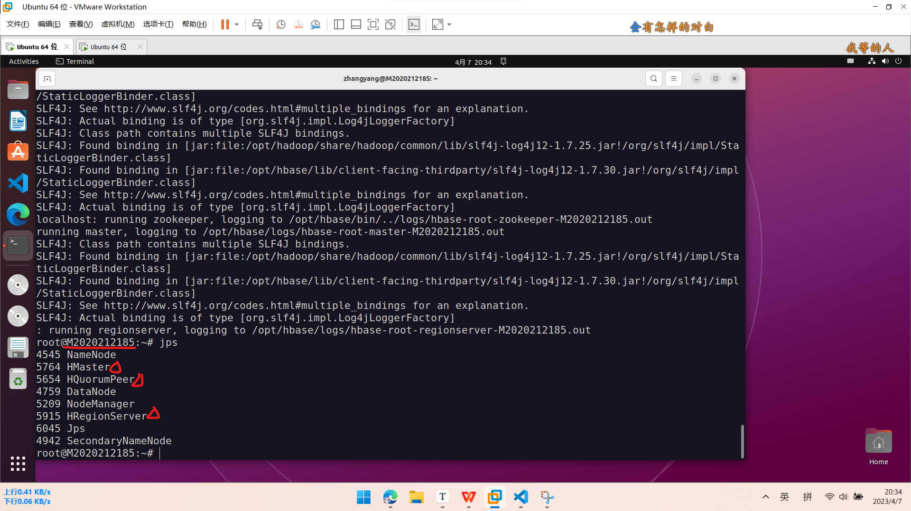

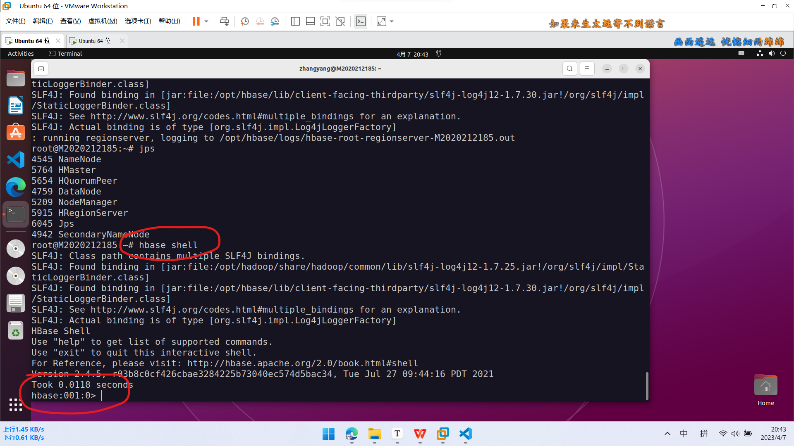

------

#### 出现的问题

：一直没有`Hmaster`


后来发现是因为当我们使用`hadoop namenode -format`格式化`namenode`时，会在`namenode`数据文件夹（这个文件夹为自己配置文件中`dfs.name.dir`的路径）中保存一个`current/VERSION`文件，记录`clusterID`，`datanode`中保存的`current/VERSION`文件中的`clustreID`的值是上一次格式化保存的`clusterID`，这样，`datanode`和`namenode`之间的ID不一致。导致`datanode`和`namenode`无法正常启动，从而`Hmaster`无法启动

需要**在所有机器上**，**重启**，删除临时文件，在master重新格式化namenode

```shell
rm -rf /tmp/*
rm -r /opt/hadoop/tmp/*
hdfs namenode -format
```

**成功解决！**

------

### HBase Shell的操作

我们创建一个名为`test`的表，并创建一个名为`data`的列族(Column Family)，指令如下:

```shell
create 'test', 'data'
```

**张扬2020212185的截图**：

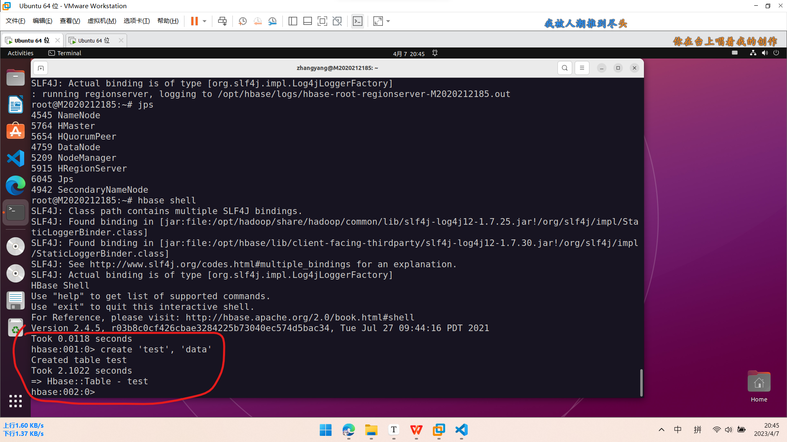

注意：HBase的表中会有一个系统默认的属性作为行键，无需自行创建，默认为put命令操作中表名后第一个数据。

为了证明新表已成功创建，运行 `list` 命令，输出用户空间中的所有表：

**张扬2020212185的截图**：

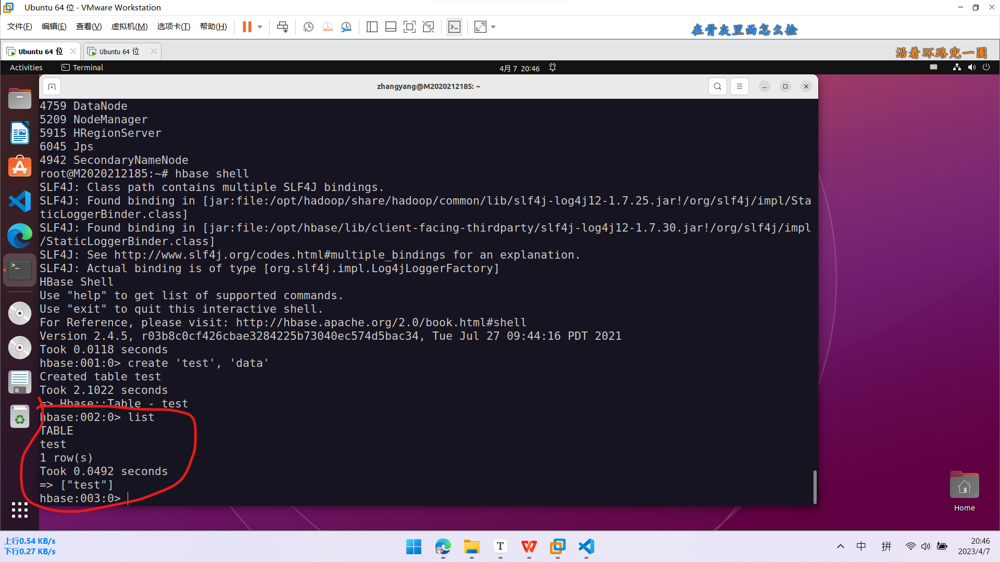

以上过程会将表 test 保存到HDFS上，位置为 `/hbase/data/default` 即我们在 `hbase-site.xml` 上配置的 `hbase.rootdir` 。打开 `http://127.0.0.1:50070/` ，选择 `utilities/Browse the file system`查看：

**张扬2020212185的截图**：

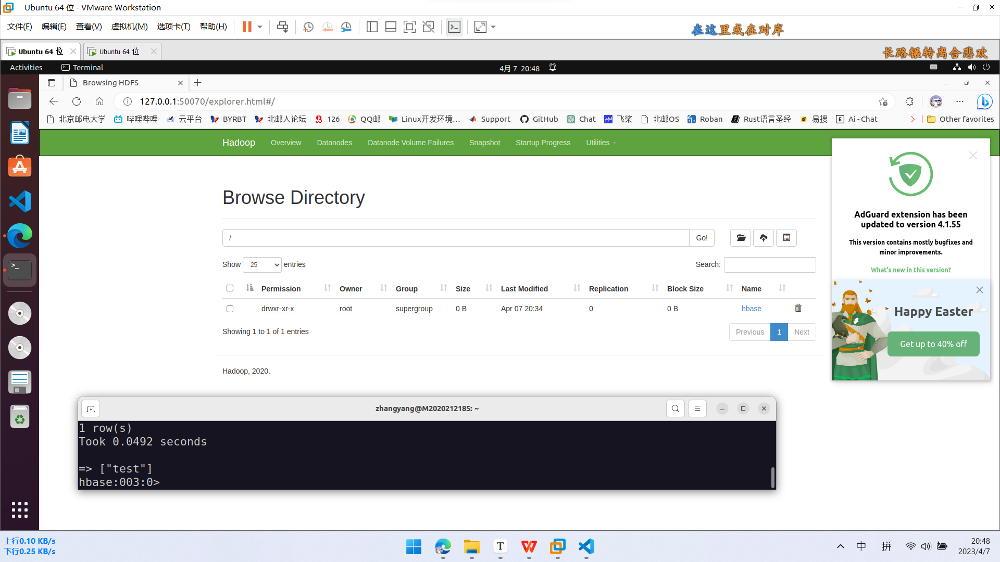

我们将数据插入到数据列族中的三个不同行和列中，获取第一行，然后列出表内容，指令如下：

```shell
put 'test', 'row1', 'data:1', 'value1'
put 'test', 'row2', 'data:2', 'value2'
put 'test', 'row3', 'data:3', 'value3'
get 'test', 'row1'
scan 'test'
```

**张扬2020212185的截图**：

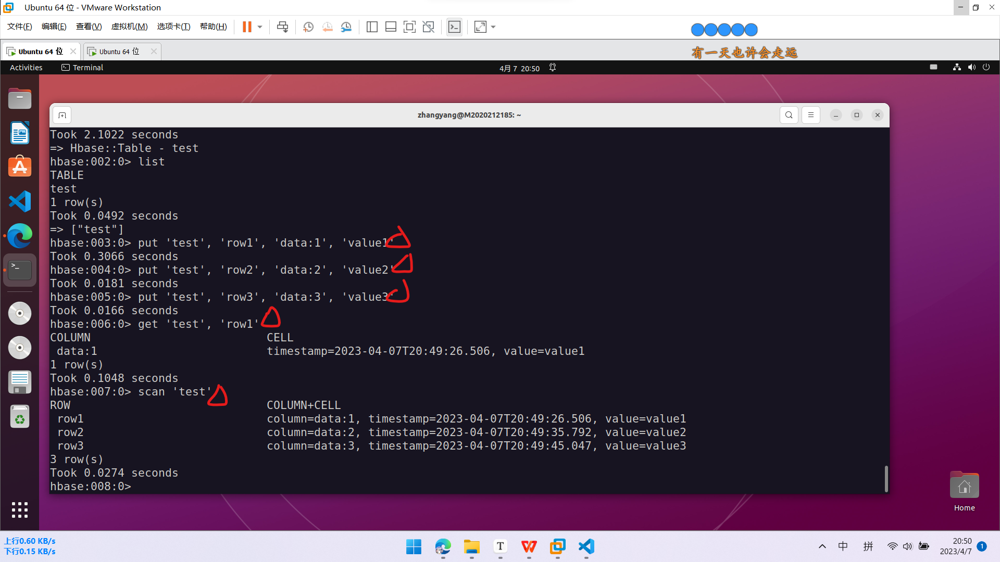

对 row1 的 data1 进行修改：

```shell
put 'test', 'row1', 'data:1', 'new value'
get 'test', 'row1'
```

**张扬2020212185的截图**：


如果想删除表，指令如下：

```shell
disable 'test'
drop 'test'
list
```

**张扬2020212185的截图**：

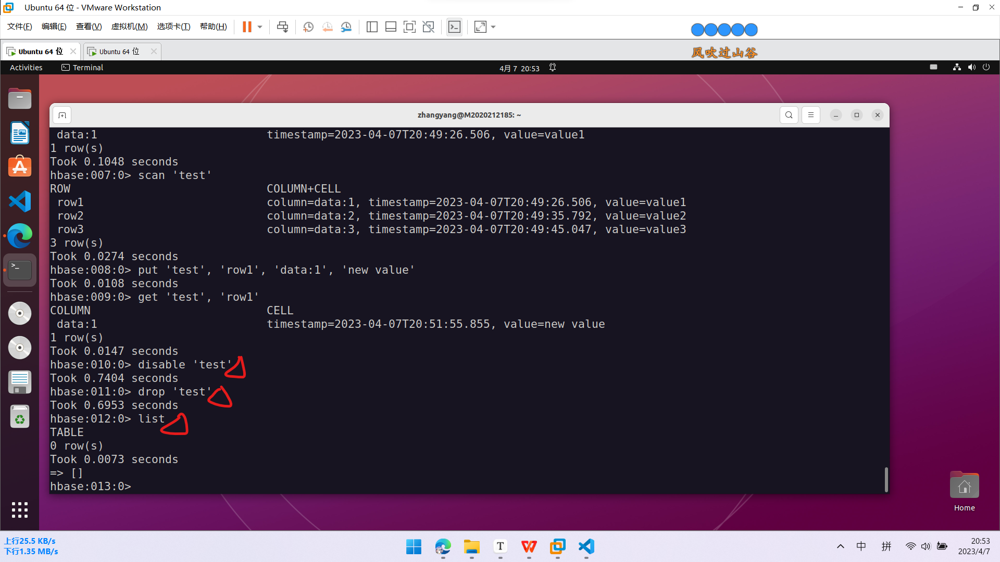

如图，test表已经被删除了。

在HDFS的 `/hbase/data/default` 目录下的test也被删除了。

离开HBase Shell的指令为 `exit` ：

HBase的关闭方法为：

```shell
stop-hbase.sh
```

**张扬2020212185的截图**：

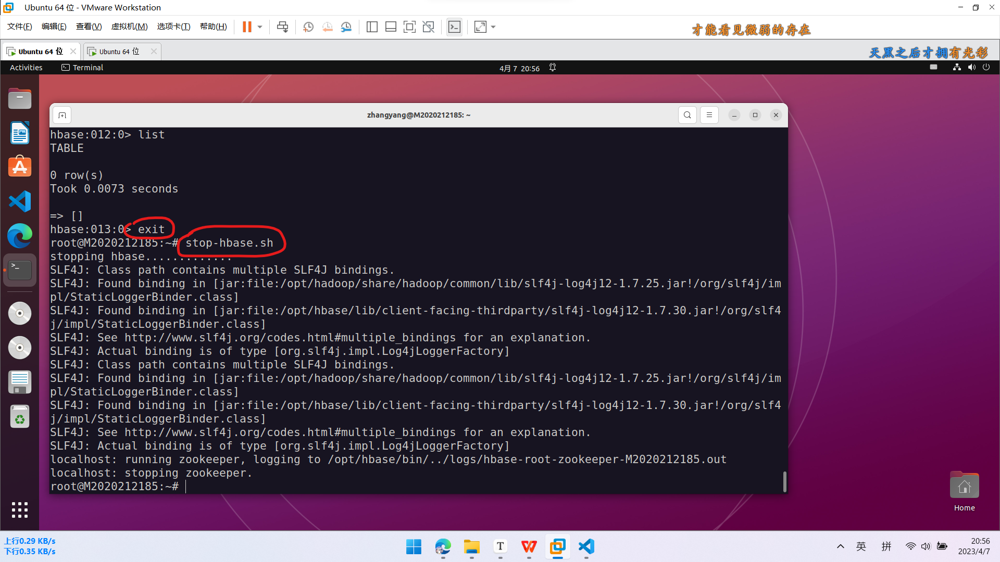

## 使用Java操作HBase

### 1-安装IDEA

```shell
sudo snap install intellij-idea-community --classic
```

**张扬2020212185的截图**：

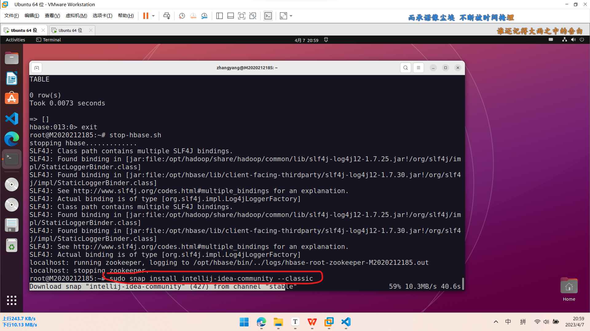

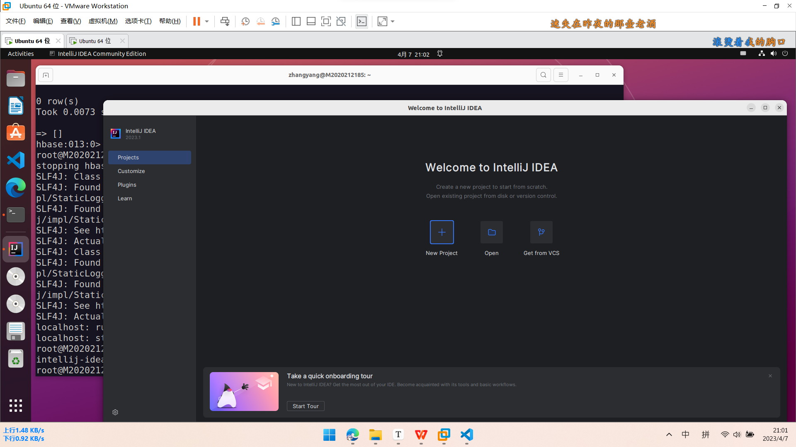

### 2-安装maven

使用以下命令下载并解压maven3.9.0：

```shell
wget https://dlcdn.apache.org/maven/maven-3/3.8.7/binaries/apache-maven-3.8.7-bin.tar.gz
tar -zxvf ~/apache-maven-3.8.7-bin.tar.gz
```

这里会404，进官网发现没有3.8.7，改为3.8.8：

```shell
wget https://dlcdn.apache.org/maven/maven-3/3.8.8/binaries/apache-maven-3.8.8-bin.tar.gz
```

**张扬2020212185的截图**：

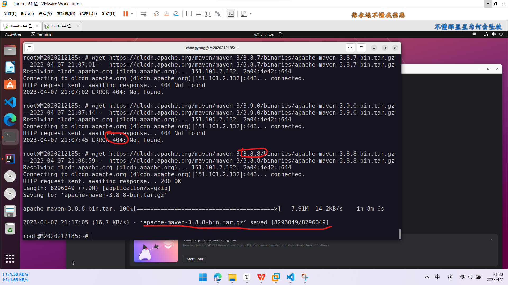

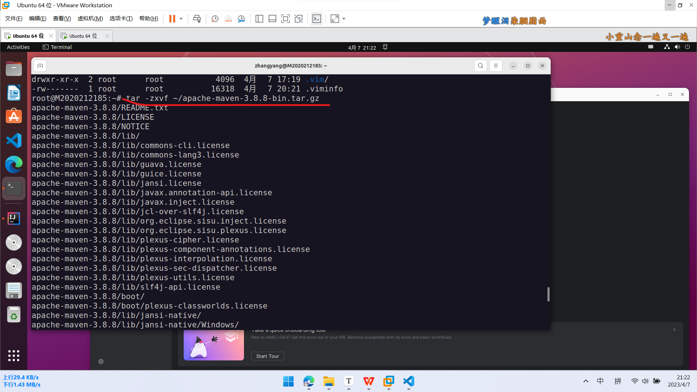

修改`/apache-maven-3.8.8/conf/settings.xml`，在其中添加如下配置：

```xml
<mirror>
        <id>alimaven</id>
        <mirrorOf>central</mirrorOf>
        <name>aliyun maven</name>
        <url>http://maven.aliyun.com/nexus/content/repositories/central/</url>
</mirror>
<mirror>
        <id>aliyunmaven</id>
        <mirrorOf>*</mirrorOf>
        <name>阿里云公共仓库</name>
        <url>https://maven.aliyun.com/repository/public</url>
</mirror>
<localRepository>/opt/maven</localRepository>

```

**张扬2020212185的截图**：

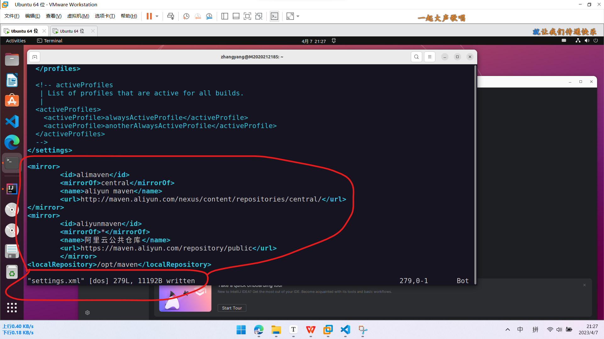

以上配置添加了一个镜像以提高下载速度，并指定了一个本地的maven仓库路径。

### 3-在IDEA中配置maven

首先创建一个java项目，并选择maven为构建工具：

**张扬2020212185的截图**：

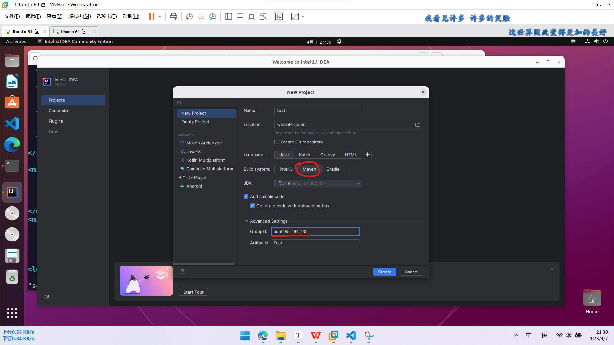

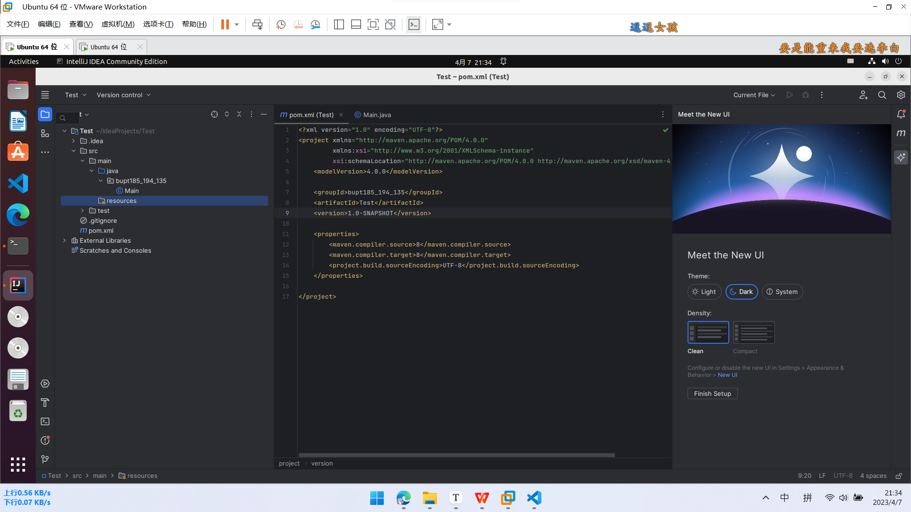

在IDEA中打开 `File/Settings/Build,Execution,Deployment/BuildTools/Maven` ，分别设置其中的`Maven home path` 、 `User setting file` 和 `Local repository` 为你的**maven安装目录**、安装目录下的 `/apache-maven-3.8.7/conf/settings.xml` 和**自己的本地仓库路径**。

**张扬2020212185的截图**：

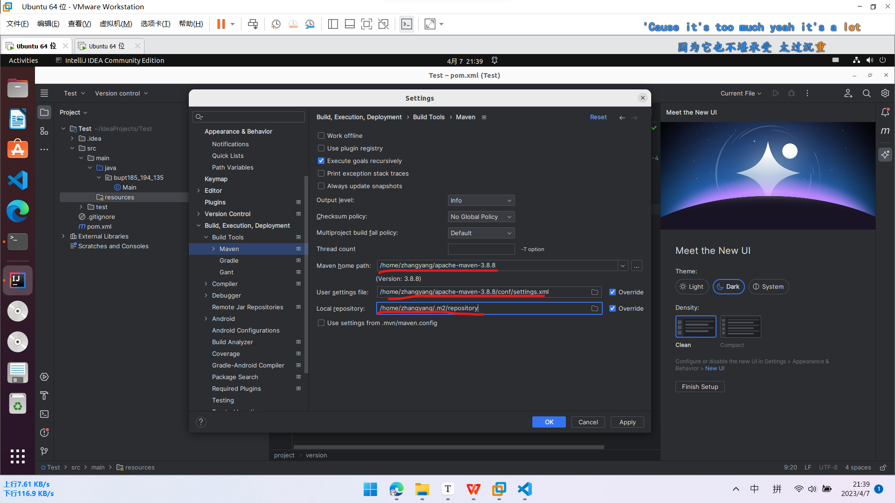

修改`pom.xml`文件如下：

```xml
<?xml version="1.0" encoding="UTF-8"?>
<project xmlns="http://maven.apache.org/POM/4.0.0"
         xmlns:xsi="http://www.w3.org/2001/XMLSchema-instance"
         xsi:schemaLocation="http://maven.apache.org/POM/4.0.0 http://maven.apache.org/xsd/maven-4.0.0.xsd">
    <modelVersion>4.0.0</modelVersion>

    <groupId>bupt185_194_135</groupId>
    <artifactId>Test</artifactId>
    <version>1.0-SNAPSHOT</version>

    <properties>
        <maven.compiler.source>8</maven.compiler.source>
        <maven.compiler.target>8</maven.compiler.target>
        <project.build.sourceEncoding>UTF-8</project.build.sourceEncoding>
    </properties>

    <dependencies>
        <dependency>
            <groupId>log4j</groupId>
            <artifactId>log4j</artifactId>
            <version>1.2.17</version>
        </dependency>
        <dependency>
            <groupId>org.apache.hbase</groupId>
            <artifactId>hbase-client</artifactId>
            <version>2.4.5</version>
            <exclusions>
                <exclusion>
                    <artifactId>slf4j-api</artifactId>
                    <groupId>org.slf4j</groupId>
                </exclusion>
                <exclusion>
                    <artifactId>slf4j-log4j12</artifactId>
                    <groupId>org.slf4j</groupId>
                </exclusion>
            </exclusions>
        </dependency>
        <dependency>
            <groupId>org.apache.hbase</groupId>
            <artifactId>hbase</artifactId>
            <version>2.4.5</version>
            <type>pom</type>
        </dependency>
        <dependency>
            <groupId>org.apache.hbase</groupId>
            <artifactId>hbase-server</artifactId>
            <version>2.4.5</version>
        </dependency>
    </dependencies>

</project>
```

**张扬2020212185的截图**：

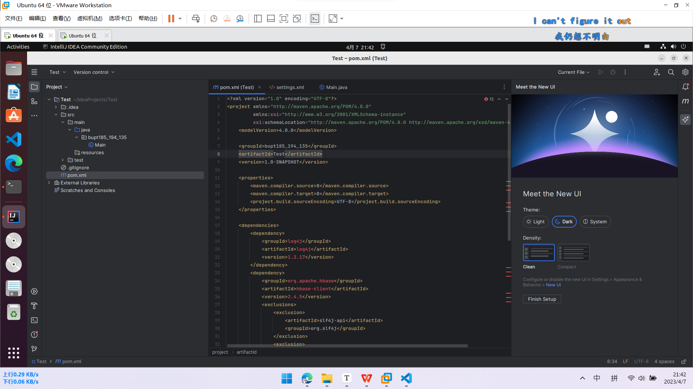

### 4-配置log4j

在java项目的`resources`文件夹下添加 `log4j.properties` 文件：

内容如下：

```properties
log4j.rootLogger=debug, stdout, R
log4j.appender.stdout=org.apache.log4j.ConsoleAppender
log4j.appender.stdout.layout=org.apache.log4j.PatternLayout
# Pattern to output the caller's file name and line number.
log4j.appender.stdout.layout.ConversionPattern=%5p [%t] (%F:%L) - %m%n
log4j.appender.R=org.apache.log4j.RollingFileAppender
log4j.appender.R.File=example.log
log4j.appender.R.MaxFileSize=100KB
# Keep one backup file
log4j.appender.R.MaxBackupIndex=5
log4j.appender.R.layout=org.apache.log4j.PatternLayout
log4j.appender.R.layout.ConversionPattern=%p %t %c - %m%n
```

**张扬2020212185的截图**：

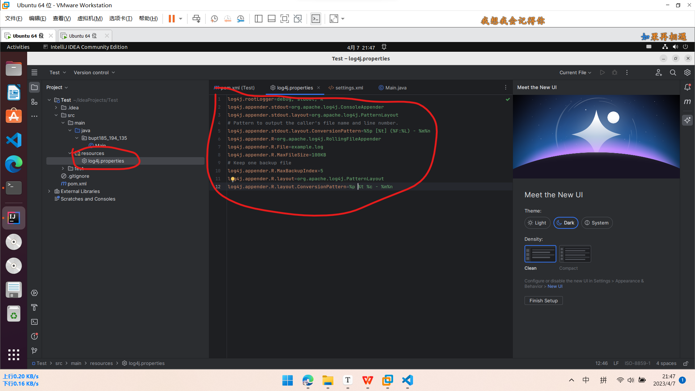

### 5-在java中调用HBase

实例代码Main.java如下：

```java
package bupt185_194_135;
import org.apache.hadoop.hbase.TableName;
import org.apache.hadoop.hbase.client.Admin;
import org.apache.hadoop.hbase.client.ColumnFamilyDescriptorBuilder;
import org.apache.hadoop.hbase.client.TableDescriptorBuilder;
import org.apache.hadoop.hdfs.web.JsonUtil;
import org.slf4j.Logger;
import org.slf4j.LoggerFactory;
import org.apache.hadoop.conf.Configuration;
import org.apache.hadoop.hbase.HBaseConfiguration;
import org.apache.hadoop.hbase.client.*;
import org.apache.hadoop.hbase.util.Bytes;
import org.apache.commons.collections.CollectionUtils;
import org.apache.commons.lang.StringUtils;
import org.apache.hadoop.hbase.*;
import java.io.IOException;
import java.util.*;
public class Main {
    private static final Logger logger = LoggerFactory.getLogger(Main.class);
    public static void main(String[] args) {
        try (Connection connection = getConnection()) {
            TableName tableName = TableName.valueOf("DeviceState");
            //创建DeviceState表
            createTable(connection, tableName, "name", "state");
            logger.info("创建表 {}", tableName.getNameAsString());
            //写入数据
            put(connection, tableName, "row1", "name", "c1", "空调");
            put(connection, tableName, "row1", "state", "c2", "打开");
            put(connection, tableName, "row2", "name", "c1", "电视机");
            put(connection, tableName, "row2", "state", "c2", "关闭");
            logger.info("写入数据.");
            String value = getCell(connection, tableName, "row1", "state", "c2");
            logger.info("读取单元格-row1.state:{}", value);
            Map<String, String> row = getRow(connection, tableName, "row2");
            logger.info("读取单元格-row2:{}", row);
            List<Map<String, String>> dataList = scan(connection, tableName, null, null);
            logger.info("扫描表结果-:\n{}", dataList);
            //删除DeviceState表
            deleteTable(connection, tableName);
            logger.info("删除表 {}", tableName.getNameAsString());
            logger.info("操作完成.");
        } catch (Exception e) {
            logger.error("操作出错", e);
        }
    }
    public static void createTable(Connection connection, TableName tableName,
                                   String... columnFamilies) throws IOException, IOException {
        try (Admin admin = connection.getAdmin()) {
            if (admin.tableExists(tableName)) {
                logger.warn("table:{} exists!", tableName.getName());
            } else {
                TableDescriptorBuilder builder =
                        TableDescriptorBuilder.newBuilder(tableName);
                for (String columnFamily : columnFamilies) {
                    builder.setColumnFamily(ColumnFamilyDescriptorBuilder.of(columnFamily));
                }
                admin.createTable(builder.build());
                logger.info("create table:{} success!", tableName.getName());
            }
        }
    }
    public static void put(Connection connection, TableName tableName,
                           String rowKey, String columnFamily, String column, String
                                   data) throws IOException {
        try (Table table = connection.getTable(tableName)) {
            Put put = new Put(Bytes.toBytes(rowKey));
            put.addColumn(Bytes.toBytes(columnFamily), Bytes.toBytes(column),
                    Bytes.toBytes(data));
            table.put(put);
        }
    }
    public static String getCell(Connection connection, TableName tableName, String
            rowKey, String columnFamily, String column) throws IOException {
        try (Table table = connection.getTable(tableName)) {
            Get get = new Get(Bytes.toBytes(rowKey));
            get.addColumn(Bytes.toBytes(columnFamily), Bytes.toBytes(column));
            Result result = table.get(get);
            List<Cell> cells = result.listCells();
            if (CollectionUtils.isEmpty(cells)) {
                return null;
            }
            String value = new String(CellUtil.cloneValue(cells.get(0)), "UTF-8");
            return value;
        }
    }
    public static Map<String, String> getRow(Connection connection, TableName
            tableName, String rowKey) throws IOException {
        try (Table table = connection.getTable(tableName)) {
            Get get = new Get(Bytes.toBytes(rowKey));
            Result result = table.get(get);
            List<Cell> cells = result.listCells();
            if (CollectionUtils.isEmpty(cells)) {
                return Collections.emptyMap();
            }
            Map<String, String> objectMap = new HashMap<>();
            for (Cell cell : cells) {
                String qualifier = new String(CellUtil.cloneQualifier(cell));
                String value = new String(CellUtil.cloneValue(cell), "UTF-8");
                objectMap.put(qualifier, value);
            }
            return objectMap;
        }
    }
    public static List<Map<String, String>> scan(Connection connection, TableName
            tableName, String rowkeyStart, String rowkeyEnd) throws IOException {
        try (Table table = connection.getTable(tableName)) {
            ResultScanner rs = null;
            try {
                Scan scan = new Scan();
                if (!StringUtils.isEmpty(rowkeyStart)) {
                    scan.withStartRow(Bytes.toBytes(rowkeyStart));
                }
                if (!StringUtils.isEmpty(rowkeyEnd)) {
                    scan.withStopRow(Bytes.toBytes(rowkeyEnd));
                }
                rs = table.getScanner(scan);
                List<Map<String, String>> dataList = new ArrayList<>();
                for (Result r : rs) {
                    Map<String, String> objectMap = new HashMap<>();
                    for (Cell cell : r.listCells()) {
                        String qualifier = new String(CellUtil.cloneQualifier(cell));
                        String value = new String(CellUtil.cloneValue(cell), "UTF-8");
                        objectMap.put(qualifier, value);
                    }
                    dataList.add(objectMap);
                }
                return dataList;
            } finally {
                if (rs != null) {
                    rs.close();
                }
            }
        }
    }
    public static void deleteTable(Connection connection, TableName tableName) throws
            IOException {
        try (Admin admin = connection.getAdmin()) {
            if (admin.tableExists(tableName)) {
        //现执行disable
                admin.disableTable(tableName);
                admin.deleteTable(tableName);
            }
        }
    }
    public static Connection getConnection() {
        try {
        //获取配置
            Configuration configuration = getConfiguration();
            return ConnectionFactory.createConnection(configuration);
        } catch (IOException e) {
            throw new RuntimeException(e);
        }
    }
    private static Configuration getConfiguration() {
        Configuration config = HBaseConfiguration.create();
        config.set("hbase.zookeeper.quorum", "localhost:2181");
        return config;
    }
}
```

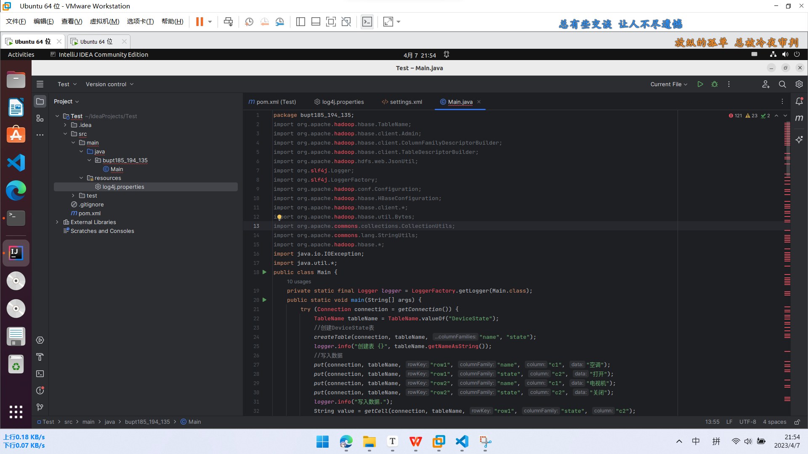